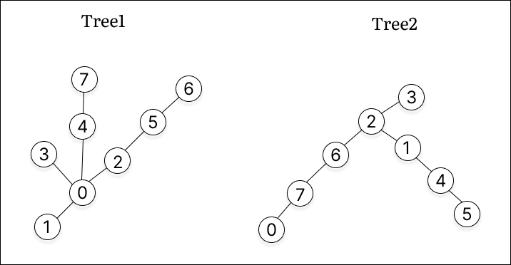
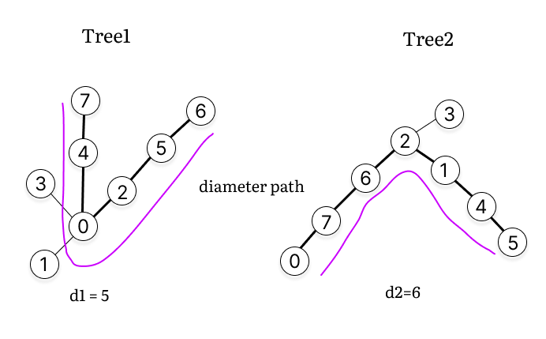
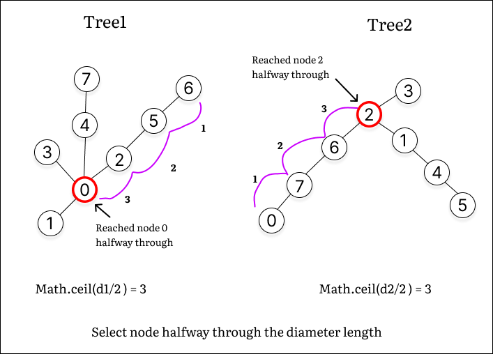
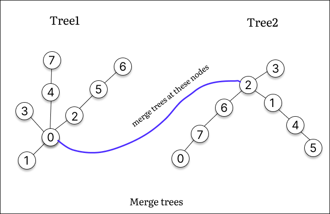
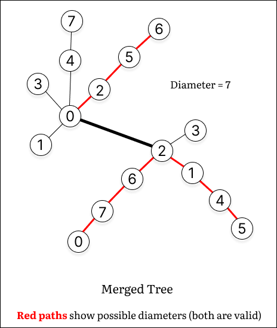

# POTD 12-24-2024

## 3203. Find Minimum Diameter After Merging Two Trees [[Problem](https://leetcode.com/problems/find-minimum-diameter-after-merging-two-trees/description/)][[Code](https://github.com/AKR-2803/DSA-Declassified/blob/main/POTD-Leetcode/December/code/FindMinDiameterAfterMergingTwoTrees.java)]

<!--   -->
<!--    -->


#### **Tags:** [`Tree`](https://leetcode.com/problem-list/tree/) [`Depth-First Search`](https://leetcode.com/problem-list/depth-first-search/) [`Breadth-First Search`](https://leetcode.com/problem-list/breadth-first-search/) [`Graph`](https://leetcode.com/problem-list/graph/)

### Solve [Leetcode 1245. Tree Diameter (Unlocked)](https://leetcode.ca/2019-04-28-1245-Tree-Diameter/) before attempting this question.

## Intuition
- First obvious thing to relalise is that we need to know how to find the diameter of the tree(note that it is **not a binary tree**, basically an undirected acyclic graph). Solve [Leetcode 1245. Tree Diameter](https://leetcode.ca/2019-04-28-1245-Tree-Diameter/) before attempting this question for the same.

- To minimize the merged diameter, connect nodes near the midpoint of each diameter to reduce the overall length effectively.

## Approach

- **Calculate the Diameter of Each Tree:**
    - To calculate the diameter of a tree, use the **two-pass DFS** (BFS can also be used)
        - Start BFS/DFS from an arbitrary node to find the farthest node (let's call this `farthest1`).
        - From `farthest1`, perform another DFS to find the farthest node from it (`farthest2`), and the distance between `farthest1` and `farthest2` is the tree's diameter.

- **Merge the Trees:**
    - After calculating the diameters (`d1` for tree1 and `d2` for tree2), the best way to minimize the resulting tree's diameter is by connecting the **middle nodes of both trees**.
    - To calculate the final diameter after merging both trees is:
     ``` 
     dMerge = Math.ceil(d1 / 2) + 1 + Math.ceil(d2 / 2)
     ```
    - This formula adds distance from the middle nodes of both trees and the added edge (`+ 1`) between them.
    
### Merging procedure

- Let us understand the merging procedure using the following test case
```
Input
edges1 = [[0,1], [0,2], [0,3], [0,4], [2,5], [4,7], [5,6]]
edges2 = [[0,7], [6,7], [2,6], [2,3], [2,1], [1,4], [4,5]]

Output
7
```
    
| 1. Tree1 and Tree2             |    2. Compute diameters       |
|---------------------------| ---------------------------------------- |
|  |  | 


| 3. Find middle nodes             |    4. Merge Trees    |
|---------------------------| ---------------------------------------- |
|  |  | 

| 5. Final Merged Tree          |   
|---------------------------| 
|  |


- **Determine the Minimum Diameter:**
    - The minimum diameter after merging the two trees is the maximum of the three possible values:
     ``` 
     result = max(d1, d2, dMerge)
     ```
    - **Why consider d1 and d2 aftger merging?**
        - As merging **might not reduce** the diameter, and the final diameter could still come from one of the original trees.

- **Edge Case:**
   - One of the trees has 1 node and the other has 2 nodes
   ```java
    // Special case where one tree has diameter `1` and the other has diameter `0`
    if ((d1 == 1 && d2 == 0) || (d1 == 0 && d2 == 1)) {
        return Math.max(d1, d2) + 1;
    }
   ```

### Complexity Analysis

- **Time Complexity:_O(n + m)_** 
    - `n` and `m` are the no. of nodes in the two trees.
    - DFS is performed on each tree to calculate the diameter, and merging involves constant-time operations.

- **Space Complexity:_O(n + m)_** 
    - `O(n + m)` for storing the adjacency lists of the two trees and stack space of recursive DFS.


#### [Code](https://github.com/AKR-2803/DSA-Declassified/blob/main/POTD-Leetcode/December/code/FindMinDiameterAfterMergingTwoTrees.java)
```java
class Solution {
    private boolean[] visited;
    private int maxDiameter;
    private int farthestNode;

    public int minimumDiameterAfterMerge(int[][] tree1Edges, int[][] tree2Edges) {
        return calculateMinimumDiameter(tree1Edges, tree2Edges);
    }

    public int calculateMinimumDiameter(int[][] tree1Edges, int[][] tree2Edges) {
        int n = tree1Edges.length + 1; // no. of nodes in tree1
        int m = tree2Edges.length + 1; // no. of nodes in tree2

        List<List<Integer>> adj1 = buildAdjList(tree1Edges, n);  // adjacency list tree1
        List<List<Integer>> adj2 = buildAdjList(tree2Edges, m);

        int d1 = n == 1 ? 0 : findDiameter(adj1, n);    // tree1 diameter
        int d2 = m == 1 ? 0 : findDiameter(adj2, m);

        // If both trees have only one node, the merged tree has a diameter of `1`
        if (d1 == 0 && d2 == 0) {
            return 1; 
        }

        // Special case where one tree has diameter `1` and the other has diameter `0`
        if ((d1 == 1 && d2 == 0) || (d1 == 0 && d2 == 1)) {
            return Math.max(d1, d2) + 1;
        }

        // Calculate the new diameter of the merged tree
        // You can also write `r1 = d1+1/2`
        int r1 = (int) Math.ceil((float) d1 / 2); // middle of d1 (r => radius, just for naming convention)
        int r2 = (int) Math.ceil((float) d2 / 2);

        // mergedDiameter is MAX(d1, d2, r1 + 1 + r2)
        int mergedDiameter = Math.max(d1, d2);
        mergedDiameter = Math.max(mergedDiameter, r1 + 1 + r2);

        return mergedDiameter;
    }

    // Build adjacency list
    public List<List<Integer>> buildAdjList(int[][] edges, int totalNodes) {
        List<List<Integer>> adjList = new ArrayList<>(totalNodes);
        for (int i = 0; i < totalNodes; i++) {
            adjList.add(new ArrayList<>());
        }
        for (int[] edge : edges) {
            adjList.get(edge[0]).add(edge[1]);
            adjList.get(edge[1]).add(edge[0]);
        }
        return adjList;
    }

    // Find the diameter of a tree using two-pass DFS
    public int findDiameter(List<List<Integer>> adjList, int totalNodes) {
        visited = new boolean[totalNodes];
        farthestNode = adjList.get(0).get(0); // arbitrary starting point
        maxDiameter = 0;

        // First DFS to find one endpoint of the diameter
        dfs(farthestNode, 0, adjList);

        // Reset visited array and perform DFS from the farthest node to calculate the diameter
        visited = new boolean[totalNodes];
        dfs(farthestNode, 0, adjList);

        return maxDiameter;
    }

    // DFS to find the farthest node and track the maximum distance
    public void dfs(int node, int distance, List<List<Integer>> adjList) {
        if (visited[node]) {
            return;
        }

        visited[node] = true;
        
        if (maxDiameter < distance) {
            // keep updating the max distance and the farthest node
            maxDiameter = distance;
            farthestNode = node;
        }

        for (int neighbor : adjList.get(node)) {
            dfs(neighbor, distance + 1, adjList);
        }
    }
}
```