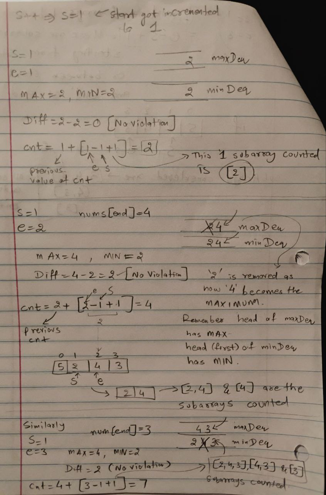
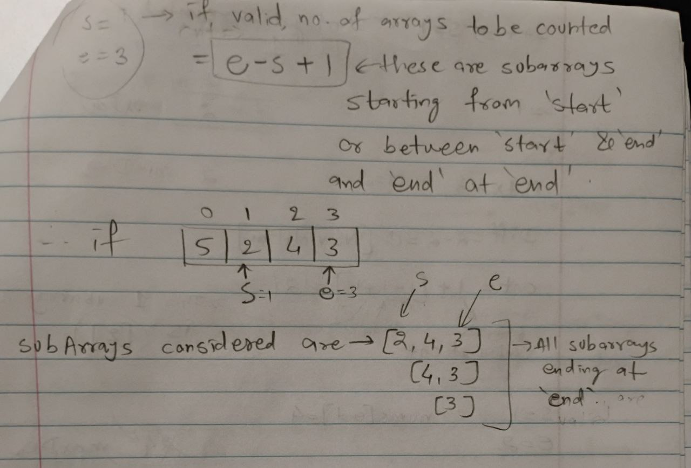

# 2762. Continuous Subarrays [[Problem](https://leetcode.com/problems/continuous-subarrays/description/)][[Code](https://github.com/AKR-2803/DSA-Declassified/blob/main/POTD/December/code/ContinuousSubarrays.java)]

## Approach

### 1. Brute-Force

- The obvious brute-force approach is simple, check all subarrays if they satisfy the condition
- But total subarrays in an `n-sized` array are `n*(n+1)/2`, which is order of `O(n^2)`. 
- Moreover you iterate through each of them to find whether they are continuous or not.
- This brings the time complexity in order of `O(n^3)`, which is exactly why TLE (Time Limit Exceeded) occurs in leetcode (2129/2135 case).

Here's the code for the brute-force approach:

```java
// Not preferable O(n^3) solution
class Solution {
    public long continuousSubarrays(int[] nums) {
        int n = nums.length;    
        long count = 0;

        // this approach will take O(n^3) time, hence TLE will occur
        int start = 0;
        for(int end = 0; end < n; end++){
            while(!isCont(nums, start, end)){
                start++;
            }
            count += end - start + 1; // count total valid subarrays for given `start` and `end` pointers
        }

        return count;
    }

    // function to iterate thorugh a subarray to check if it is continuous or not
    public boolean isCont(int[] nums, int start, int end){
        for(int i = start; i <= end; i++){
            for(int j = i + 1; j <= end; j++){
                int diff = Math.abs(nums[i] - nums[j]);
                if(diff > 2){
                    return false;   // condition for continuous array violated
                }
            }
        }
        return true;
    }
}
```


### 2.  A better-approach: Sliding Window with Deque

We utilize a **sliding window** technique with the help of two **deques**:
- `maxDeq`: Maintains the maximum values in the current sliding window.
- `minDeq`: Maintains the minimum values in the current sliding window.

#### Steps:

-  **Iterate with a sliding window (`end` pointer):**
   - Expand the window by adding `nums[end]` to both `maxDeq` and `minDeq`.

-  **Maintain Monotonic Deques:**
   - `maxDeq`: Ensure elements are in **decreasing order** by removing smaller elements from the back.
   - `minDeq`: Ensure elements are in **increasing order** by removing larger elements from the back.

- **Validate the Window:**
   - The difference between the maximum (`maxDeq.peekFirst()`) and minimum (`minDeq.peekFirst()`) values should not exceed `2`.
   - If the condition is violated, shrink the window by incrementing the `start` pointer and removing the corresponding values from the deques.

- **Count Valid Subarrays:**
   - For each valid window, the number of subarrays ending at index `end` is given by: `end - start + 1`

- **Return Total Count:**
   - Add `count` from all valid windows.

#### Complexity Analysis

- **Time Complexity:**
   - Each element is added and removed from the deques at most once, hence `O(n)`

- **Space Complexity:**
   - The two deques require `O(n)` space in the worst case.


### [Code here](https://github.com/AKR-2803/DSA-Declassified/blob/main/POTD/December/code/ContinuousSubarrays.java)

### Reference Images
| Dry run example [5,2,4,3]                                                             | 
|--------------------------------------------------------------------------------------| 
|  |
|  |
|  |