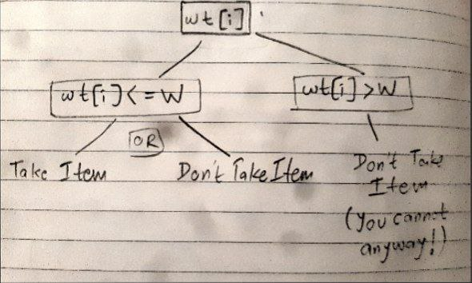
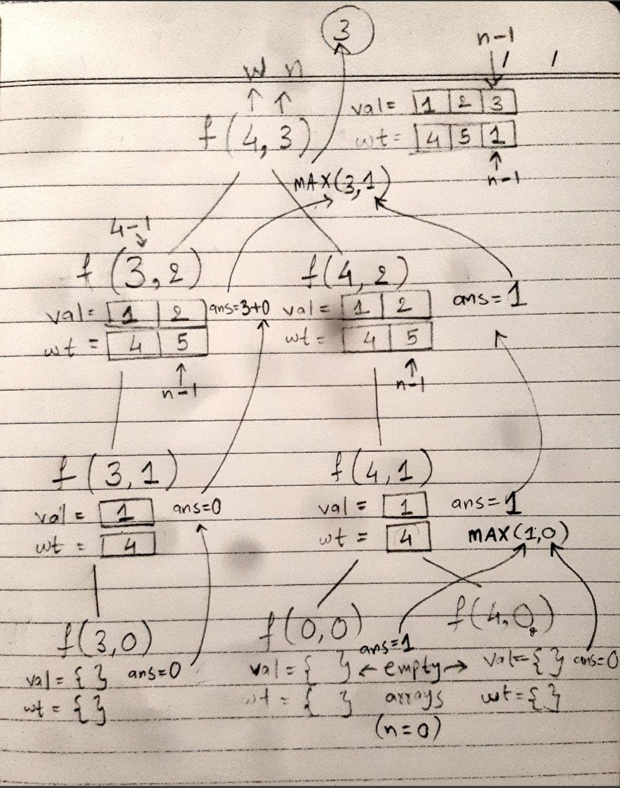

## 0-1 Knapsack [[Link](https://www.geeksforgeeks.org/problems/0-1-knapsack-problem0945/1)]

### Approach
#### Recursion
- **Base Condition** : If the array empties, or remaining capacity is 0 (bag if full), we simply return 0 (as we cannot add an item in the bag in either case).
- As [Aditya Verma](https://www.patreon.com/adityaVerma) calls it, the choice diagram for framing the solution.
- We have following possibilities [refer diagram]
  - If weight of item can be accomodated in the bag.
    - Take it (Case-1)
    - Leave it (Case-2)
  - Weight of item cannot be accomodated in the bag (Case-3)
- [Refer this example test case](https://github.com/AKR-2803/DSA-Declassified/blob/main/Problems/Dynamic%20Programming/0-1%20Knapsack/01_Knapsack/readme.md#reference-images) in diagram. `[W = 4, val[] = {1,2,3}, wt[] = {4,5,1}]`
___
#### Memoization
- Take a 2D dp array, where:
 - Rows (i) &nbsp;&nbsp;&nbsp;&nbsp;&nbsp; : `n + 1` (no. of elements + 1, so we can get `n` as an index itself, without getting IndexOutOfBoundsException)
 - Columns (j) : `W + 1` (capacity of the bag + 1)
- Fill the array with -1. (So we know if a value changes in the array)
- **Base condition**: Same as recursion.
- **One more check**: We will check if the current element dp[n][W] has changed, if yes, that means it was calculated and we return it, i.e. `if(dp[n][W] != -1){ return dp[n][W];}` This is why we filled the `dp[][]` array with -1s.
- Now save the answer in `dp[n][W]` and return it.
___

#### Tabulation
- Take a 2D dp array, where:
 - Rows (i) &nbsp;&nbsp;&nbsp;&nbsp;&nbsp; : `n+1` (no. of elements + 1)
 - Columns (j) : `W+1` (capacity of the bag + 1)
- **Initialization**: The first row and column will be all 0s, because:
 - first-row: represents no. of elements in wt array `n = 0`, i.e. it is empty array.
 - first-column: represents capacity of the bag `W = 0`, hence no item can be added, i.e. value is 0.
- Iterate through each cell of the dp[][] array and use the same logic as before. 
- Replacements : `n -> i`, `W -> j`
___
### Reference Images

| Choice Diagram and Recursive tree | 
| ------------------ | 
|   |
|   |
