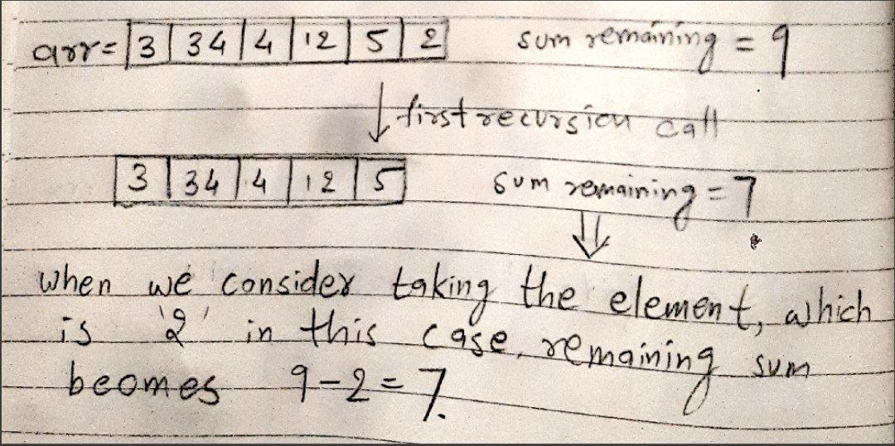

# Subset Sum [[Problem](https://www.geeksforgeeks.org/problems/subset-sum-problem-1611555638/1)][[Code](https://github.com/AKR-2803/DSA-Declassified/blob/main/Problems/Dynamic%20Programming/0-1%20Knapsack/codes/SubsetSum.java)]
## Approach

### Recursion
- It is built on top of the logic of [0-1 Knapsack](https://github.com/AKR-2803/DSA-Declassified/tree/main/Problems/Dynamic%20Programming/0-1%20Knapsack/01_Knapsack) problem.
- What does `sum` parameter in recursive function `isSumRec()` signify? It is the remaining sum required to complete, i.e. we are checking from the back of the array and taking elements. [Refer image](https://github.com/AKR-2803/DSA-Declassified/blob/main/Problems/Dynamic%20Programming/0-1%20Knapsack/Subset%20Sum/readme.md#reference-images)
- So when do we get a subset (which is our motive in the question)? Exactly! when the remaining sum becomes 0!
- **Base Condition**: Just think normally, what can these be? We have `arr` and `sum`. 
  - Either we run out of elements `N == 0` to find a subset that have a sum equal to `sum`. In this case, we did NOT find an answer, return `false`
  - Either we get the subset we want. In this case `sum == 0` (remember sum == 0 means remaining sum == 0), hence return `true`!
- The following 3 conditions work same as the [0-1 Knapsack](https://github.com/AKR-2803/DSA-Declassified/tree/main/Problems/Dynamic%20Programming/0-1%20Knapsack/01_Knapsack) problem.

- If we can accomodate the element `if(arr[N - 1] <= sum)`, we can either
  - take it `isSumRec(N - 1, arr, sum - arr[N - 1])`
  - leave it `isSumRec(N - 1, arr, sum)`
- Else we cannot accomodate it, we have to leave it `isSumRec(N - 1, arr, sum)`
___
### Memoization

- Very much possible to do, but: In an integer array, you could determine the state after checking for `dp[i][j] != -1`, but with a boolean `dp` array, checking `dp[i][j] != false` doesn't clarify if the `false` value is from the "initialization" or if it was computed during recursion.
- This ambiguity makes it impossible to ensure whether the `false` is due to the default value of the `dp` array or from a previously calculated subproblem.
- **Possible solution** is to maintain another integer 2D array to track if a cell was updated via a subproblem or not.
- However, **tabulation** provides the same time complexity and is more straightforward, so it is preferable to use the tabulation approach directly.

___
### Tabulation
- We're solving the subset sum problem using a tabulation approach.
- Initialize a 2D array `dp` with `(N+1) x (sum+1)`, where `N` is the number of elements in the array and `sum` is the desired sum.
- We fill the first row of `dp` based on the base cases:
    - If we have no elements to use, i.e. `n=0`, we can't make any sum except 0, so those cells are marked as `"false"`.
    - If we want to make a sum of 0, we can do it **without using any element**, so those cells are marked as `"true"`.
- Then, we iterate over each element in the array and each possible sum from 1 to the desired sum.
- The following 3 conditions work same as the [0-1 Knapsack](https://github.com/AKR-2803/DSA-Declassified/tree/main/Problems/Dynamic%20Programming/0-1%20Knapsack/01_Knapsack) problem.

  - If we can accomodate the element `if(arr[i - 1] <= j)`, we can either
    - take it `dp[i - 1][j - arr[i - 1]]`
    - leave it `dp[i - 1][j]`
  - Else we cannot accomodate it, we have to leave it `dp[i - 1][j]`

- Interpreting the tabulation process on pen and paper:
  - For each cell `(i, j)`, we consider two options:
    - If the current element can be included to achieve the current sum `j`, we check if we could achieve the remaining sum `(j - arr[i - 1])` using the previous elements. If so, we mark the current cell as `"true"`.
    - Otherwise, if the current element cannot be included to achieve the sum `j`, we just copy the value from the previous row.
- We continue this process until we fill the entire `dp` array.
- Finally, we return the value stored in the last cell of `dp`, which indicates whether it's possible to achieve the desired `sum` using `N` elements array, i.e., return `dp[N][sum]`.
___

### Reference Images

| Recursion (sum is remaining sum)                                              | 
|-------------------------------------------------------------------------------| 
|  |
