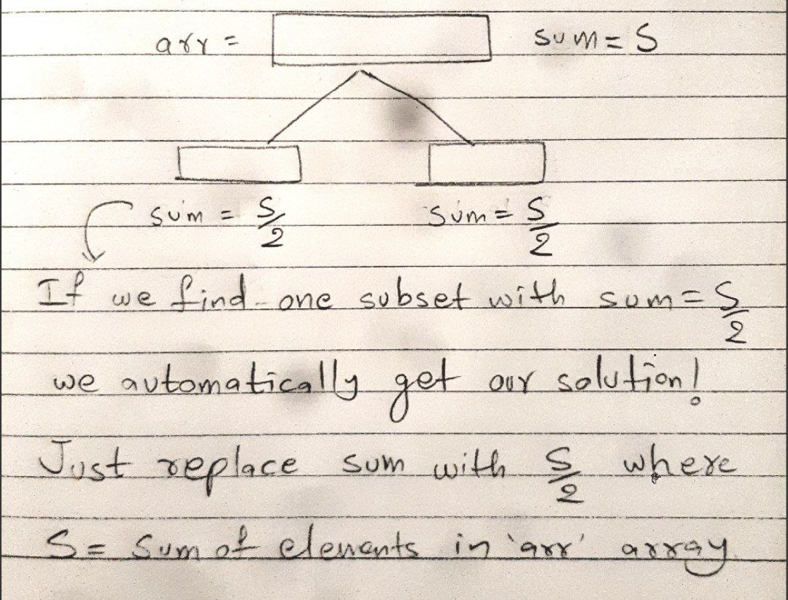

# Equal Subset Sum [[Link](https://www.geeksforgeeks.org/problems/subset-sum-problem2014/1)]

## Approach

- It is EXACTLY same as [Subset Sum](https://github.com/AKR-2803/DSA-Declassified/tree/main/Problems/Dynamic%20Programming/0-1%20Knapsack/Subset%20Sum#subset-sum-link) problem.

- Here, we need subsets with equal sum.

- Let sum of array `arr = S`. Obviously, sum of subsets should be `S/2` each.

- If we just find one subset with sum `S/2`, the remaining elements will form another subset with sum `S - S/2 = S/2`.

- We only need to find subset with sum `S/2`. 

- Hence, the ONLY CHANGE REQUIRED: Just pass `S/2` as the target sum in the code of subset sum question. DONE!
___

### Reference Images

| S - S/2 = S/2                                              | 
|-------------------------------------------------------------------------------| 
|  |
