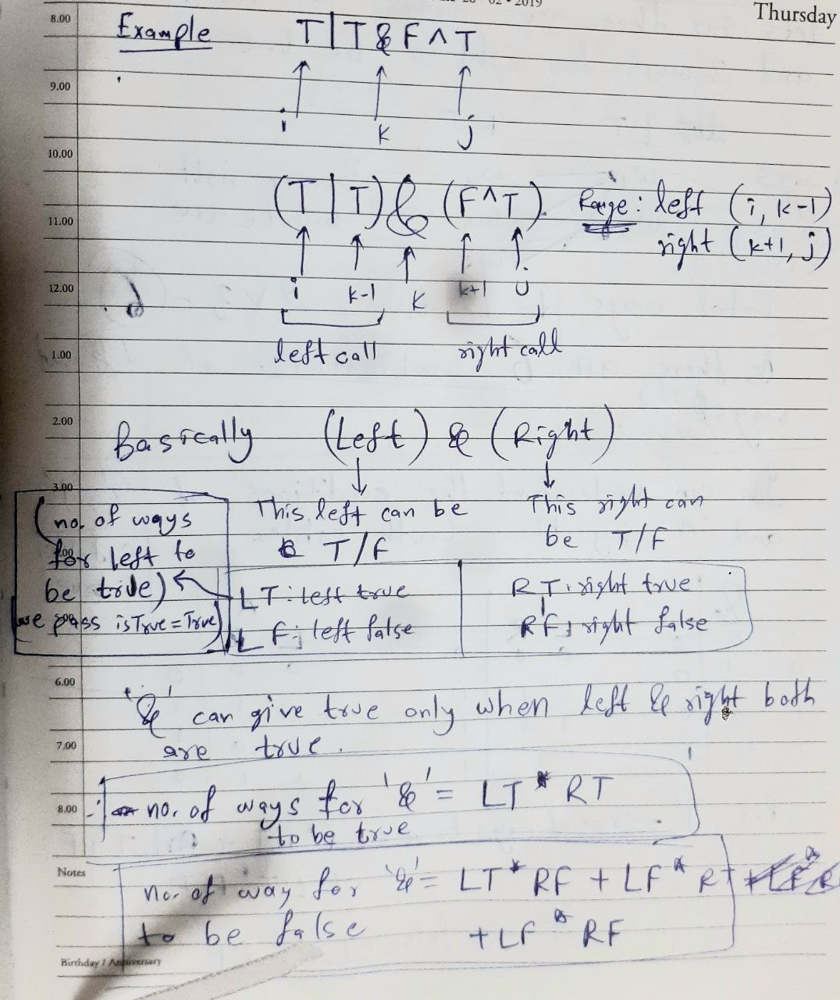
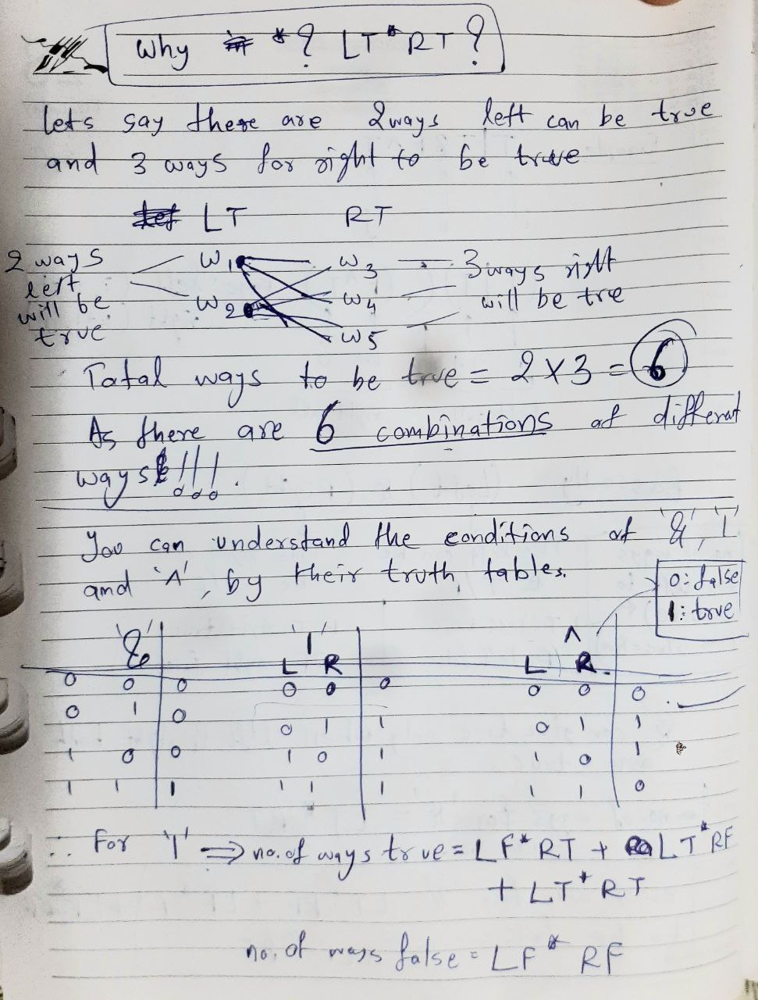
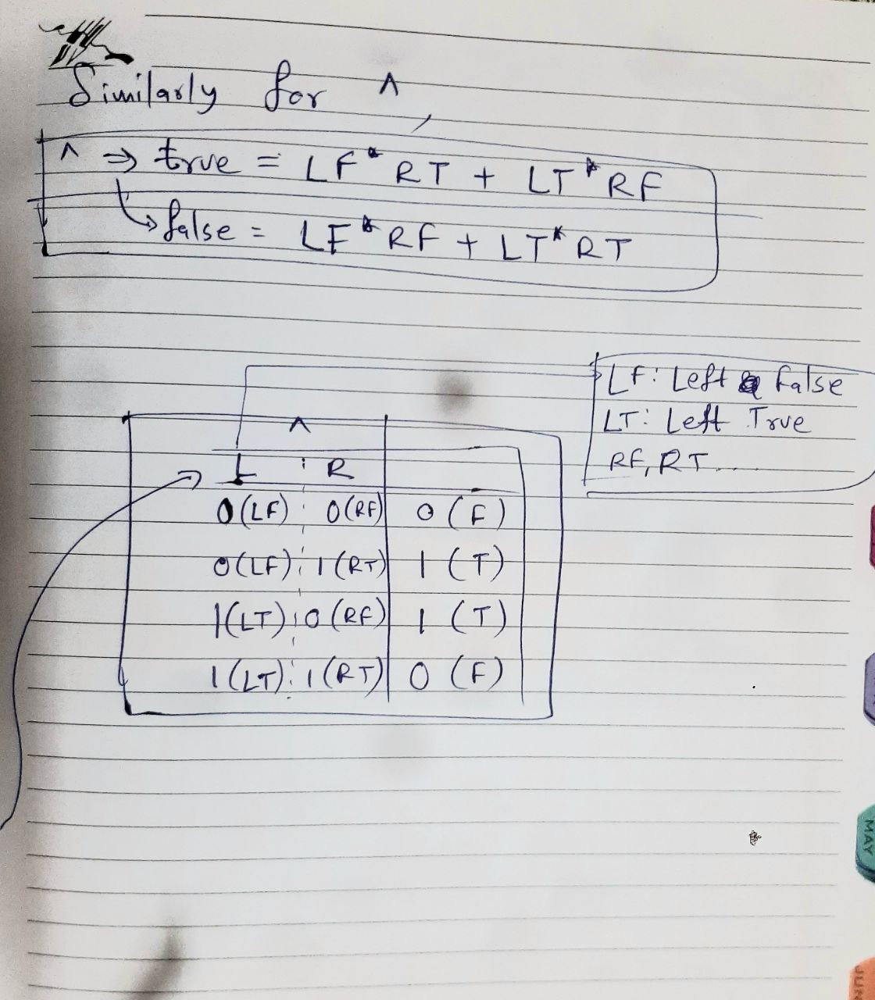
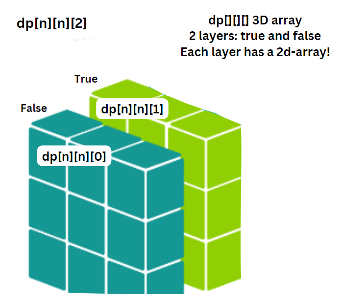

# Boolean Parenthesization [[Problem](https://www.geeksforgeeks.org/problems/boolean-parenthesization5610/1)] [[Code](https://github.com/AKR-2803/DSA-Declassified/blob/main/Problems/Dynamic%20Programming/Matrix%20Chain%20Multiplication%20(MCM)/codes/BooleanParenthesization.java)]

### Approach
___
- In this question, we need to find ways to parenthesize the expression so that it evaluates to `TRUE`. 
- Consider String `s` with length `n`. Find `i` and `j`, i = 0 and j = n-1. Before base condition, one thing to realize is that when the expression goes down to specific left and right calls, it can evaluate to `True` or `False`, hence. we need a parameter `isTrue` that carries the value we need to evaluate in a particular call ([here](https://youtu.be/pGVguAcWX4g?list=PL_z_8CaSLPWekqhdCPmFohncHwz8TY2Go&t=764)). 
- BASE CONDITION: `if(i > j)` which means an empty expression "", we cannot evaluate it to `True`, simply return 0 in this case as there are 0 ways.  
- `k` loop: if `i` is the first leftmost operand and `j` is the rightmost, that means `k` goes from `i+1` to `j-1`. Observe that `i` and `j` will be pointing to `T` or `F`, i.e. operands while `k` will point to operators (&, |, ^) this means we increment k by `k=k+2` in `k` loop.
- Inside `k loop` we calculate instances of `left(i, k-1)` and `right(k+1,j)` calls being true/false, `LT(LeftTrue)`, `LF(LeftFalse)`, `RT(RightTrue)`, `RF(RightFalse)` for each condition calculate their no. of ways. For example : for `&` operator, `if isTrue=true => ways = LT*RT`....`if isTrue=false => ways = LT*RF + LF*RT + LF*RF`. 
- Similar steps for `|` and `^` operators. Refer to the image in DSA folder.  For easier understanding and code readability, lets pass the string `s` as a character array using `s.toCharArray()` and `isTrue` as `0` (false) and `1` (true).
- Tip for problem submission on geeksforgeeks: take no. of `ways` to be long. Take modulo 1003 and then typecast it at the end.
___
#### Memoization using HashMap (Causes TLE in GFG)
- We may use a HashMap. We can store the values in a Map, the keys can be made unique just by making a combination of values of `i`, `j` and `isTrue`. `String mapKey = i + " " + j + " " + isTrue`. 
-  If there is some value, i.e. the key exists in the map, then return the value corresponsing to that key `int res = mp.getOrDefault(mapKey, -1)` 
- `if(res != -1) return mp.get(mapKey)` 
- Alternatively, we can also do something like `if mp.containsKey(mapKey) return mp.get(mapKey)` 
- However, the first way using `getOrDefault` is of course faster, as we dont have to search whether key exists or not, unlike the second case. 
___
#### Memoization using 3D Array
- Memoization using dp[ ][ ][ ] array works: We can use dp[][][] 3D-Array.
- `int[][][] dp = new int[n+1][n+1][2]` 
- Fill it with -1. 
- If value is not -1, return the value.
- `if(dp[i][j][isTrue] != -1)` return `dp[i][j][isTrue]` 
- Lastly, store value of ways, i.e. `dp[i][j][isTrue] = ways` Refer [images](https://github.com/AKR-2803/DSA-Declassified/blob/main/Problems/Dynamic%20Programming/Matrix%20Chain%20Multiplication%20(MCM)/03-Boolean-Parenthesization.md#reference-images)
___
### Reference Images

| 1 | 2 |
| ------------------ | ------------------ |
|   |   |

| 3 | 4 |
| ------------------ | ------------------ |
|   |   |