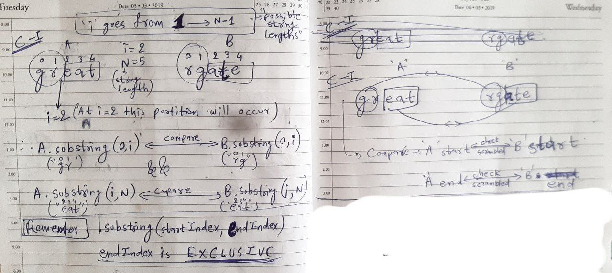
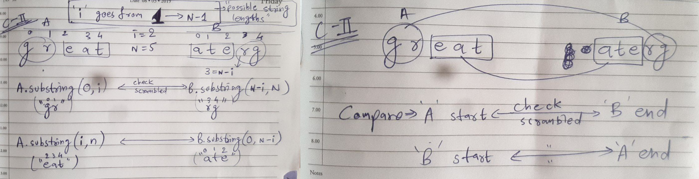
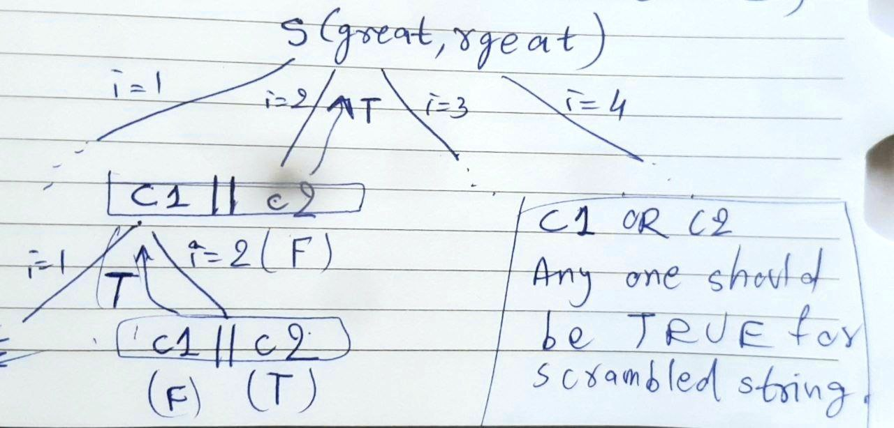
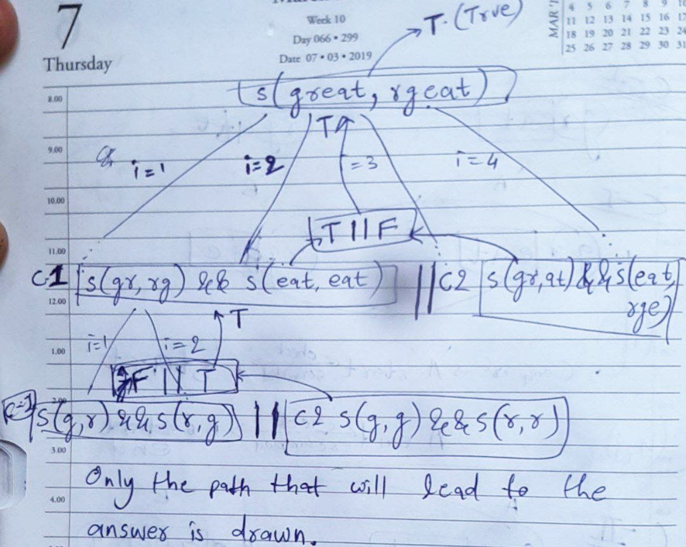

# Scrambled String
##### [Interview Bit](https://www.interviewbit.com/problems/scramble-string/) |  [Leetcode](https://leetcode.com/problems/scramble-string/description/) | [GeeksForGeeks](https://www.geeksforgeeks.org/problems/scrambled-string/1)

## Approach

### Recursive

- Consider string `s` = `"great"`. Represent it in the form of a binary tree. Swaps are allowed on non-leaf nodes only! There may/may not be swaps. That means `"great"` is a scrambled string of itself (case of no swaps).

- Next, if we swap, there might be two conditions that occur when observed carefully. Consider strings `A = "great"` and `B`, we want to check if `B` is a scrambled string of `A`.

- **Condition-I** ([refer image](https://github.com/AKR-2803/DSA-Declassified/tree/main/Problems/Dynamic%20Programming/Matrix%20Chain%20Multiplication%20(MCM)/Scrambled%20String#reference-images)): If we draw a binary tree of `A` and swap, let's say `"gr"` and `"eat"`, we get `"eatgr"`. Say `B = "eatgr"`. 
  - How do we determine if `B` is a scrambled version of `A`? We need to check substring (first two characters) of `A` and substring (last two characters) of `B`, also substring (last three characters) of `A` and substring (first three characters) of `B`.
  - Example: `A = "great"`, `B = "eatgr"`. Compare `"gr"` (first in `A` and last in `B`) and `"eat"` (last in `A` and first in `B`).
  - There might also be a case where `"gr"` was swapped (g and r swapped) making `B = "eatrg"`. Hence, we need to check if the corresponding parts of `A` and `B` are scrambled or NOT.

- **Condition-II** ([refer image](https://github.com/AKR-2803/DSA-Declassified/tree/main/Problems/Dynamic%20Programming/Matrix%20Chain%20Multiplication%20(MCM)/Scrambled%20String#reference-images)): `A = "great"`, `B = "reate"`. Here, the corresponding parts need to be checked as scrambled or not. 
  - Example: We need to check if `A`'s beginning (`"gr"`) and `B`'s beginning (`"rg"`) are scrambled, and `A`'s end (`"eat"`) and `B`'s end (`"ate"`) are scrambled.
  - Now, if **Condition-I** OR **Condition-II** is true, then YES, `B` is a scrambled string of `A`.

- To sum up:
  - **Condition-I**: Scrambled check `A` begin `B` end and `A` end `B` begin.
  - **Condition-II**: Scrambled check `A` begin `B` begin, `A` end `B` end.

- Basically, we will run a `for` loop from `i = 1` to `i = n-1`, and use `.substring()` method to pass the strings in recursive calls. Remember, `.substring(startIndex, endIndex)`... `endIndex` is exclusive.

- **BASE CONDITION**: 
  - If `A` and `B` are the same, return `true`, i.e. `if (A.compareTo(B) == 0)`.
  - Furthermore, if `A` becomes empty (`A.length() < 1`), then return `false`. We can also write `A.length() <= 1`, because if a single character remains and if it’s the same, it would be caught in `compareTo()` method above, else it will be `false`. 
  - So, `if (A.length() <= 1) return false;`.

___
### Memoization

- Declare a `Map<String, Boolean>`. The key will be a unique string `mapKey = a + " " + b`. Corresponding to each key, we store the `flag` value.

- Before the `for` loop, check if the key is present in the map (just like we used to check in a DP array `dp[i][j] != -1` =>`if (mp.containsKey(mapKey)) return mp.get(mapKey);`

- After the `for` loop, store the result in the map `mp.put(mapKey, flag);`

- Finally, return the `flag` as before.
___
## Reference [Images](https://github.com/AKR-2803/DSA-Declassified/tree/main/Problems/Dynamic%20Programming/Matrix%20Chain%20Multiplication%20(MCM)/Scrambled%20String/images)
| Condition-I | 
| ------------------ |
|  |

| Condition-II | 
| ------------------ |
|  |

| Recursive Tree | Recursive Tree (Detailed) |
| ------------------ | ------------------ |
|  |  |
